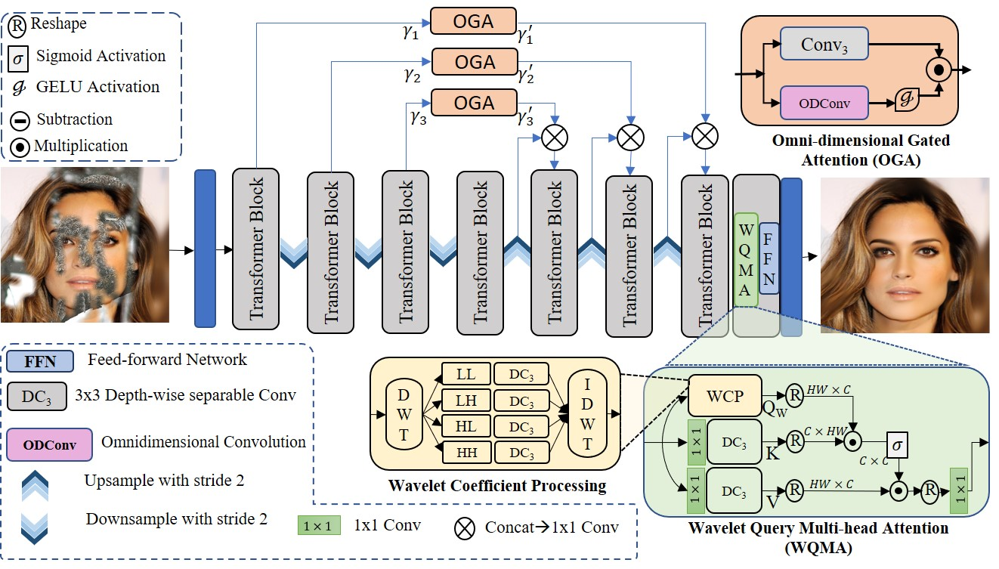

# Blind Image Inpainting via Omni-dimensional Gated Attention and Wavelet Queries [CVPRW-23]

PyTorch implementation of [Image Inpainting via Spatial Projections](https://openaccess.thecvf.com/content/CVPR2023W/NTIRE/papers/Phutke_Blind_Image_Inpainting_via_Omni-Dimensional_Gated_Attention_and_Wavelet_Queries_CVPRW_2023_paper.pdf.).

## Prerequisites

- Python 3.6+
- [PyTorch>1.0](https://pytorch.org/get-started/previous-versions/)
- cv2, numpy, PIL, torchvision

## Usage

Keep your dataset by placing images like:

    datasets
    ├── celeb
    │   ├── input
    │   │   ├── 1.png 
    │   │   ├── 2.png 
    │   │   └── ...
    │   └── target
    │       ├── 1.png
    │       └── ...
    ├── ffhq
    │   ├── input
    │   │   ├── 1.png 
    │   │   ├── 2.png 
    │   │   └── ...
    │   └── target
    │       ├── 1.png 
    │       └── ...
    ├── paris
    │   ├── input
    │   │   ├── 1.png 
    │   │   ├── 2.png 
    │   │   └── ...
    │   └── target
    │       ├── 1.png 
    │       └── ...
    └── places2
        ├── input
        │   ├── 1.png 
        │   ├── 2.png 
        │   └── ...
        └── target
            ├── 1.png 
            └── ...

## Checkpoints:
    The checkpoints are provided for:
    1. CelebA-HQ dataset.
    2. FFHQ dataset.
    3. Paris Street View dataset.
    4. Places2 dataset.
    4. Keep the checkpoints in "./checkpoints/dataset.pth"

Download the checkpoint: 

To test the network:

    CelebA_HQ dataset:
        python test.py --data_path_test ./datasets/celeb/ --task_name inpaint --dataset_name celeb --model_file ./checkpoints/celeb.pth

    FFHQ dataset:
        python test.py --data_path_test ./datasets/ffhq/ --task_name inpaint --dataset_name ffhq --model_file ./checkpoints/ffhq.pth

    Places2 dataset:
        python test.py --data_path_test ./datasets/places/ --task_name inpaint --dataset_name places --model_file ./checkpoints/places.pth

    Paris Street View dataset:
        python test.py --data_path_test ./datasets/paris/ --task_name inpaint --dataset_name paris --model_file ./checkpoints/paris.pth 
        

The results will be stored in:

    ./results/respective_dataset_name/

## Citation
If our method is useful for your research, please consider citing:

    @inproceedings{phutke2023blind,
      title={Blind Image Inpainting via Omni-Dimensional Gated Attention and Wavelet Queries},
      author={Phutke, Shruti S and Kulkarni, Ashutosh and Vipparthi, Santosh Kumar and Murala, Subrahmanyam},
      booktitle={Proceedings of the IEEE/CVF Conference on Computer Vision and Pattern Recognition},
      pages={1251--1260},
      year={2023}
    }

